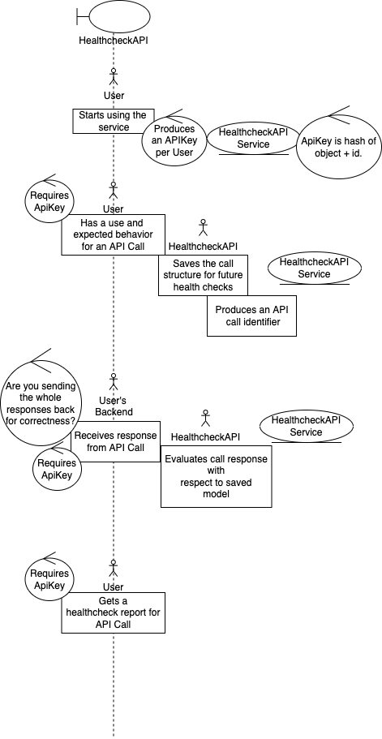

# HealthcheckAPI

Track the health of your API Calls

## Built using

* [Spring Web](https://docs.spring.io/spring-boot/docs/2.7.4/reference/htmlsingle/#web)
* Java 11
* REST API
* MVC Design Pattern
* Microservices

## Architecture

### Event Storming Big Picture

The following diagram outlines the business relevant events.

