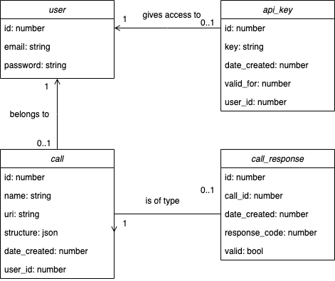

# HealthcheckAPI

Track the health of your API Calls

## Built using

* [Spring Web](https://docs.spring.io/spring-boot/docs/2.7.4/reference/htmlsingle/#web)
* Java 11
* REST API
* MVC Design Pattern
* Microservices

## Architecture

### Event Storming Big Picture

The following diagram outlines the business relevant events.

### Data diagrams

Here are the data structures used for this project.

### Endpoints

- User
    - **/user/register**
        - **POST**: creates a new user given an email and password
    - **/user/{id}**
        - **GET**: Gets a user by id.
        - **PUT**: Receives email and updates email.
        - **DELETE**: Deletes user, api keys, calls, and responses.
- Api Key
    - **/apikey/generate**
        -  **POST**: Creates a new api key returns the key.
    - **/apikey/revoke?apikey={key}**
        -  **DELETE**: Revokes an api key.
- Call
    - **/call?apikey={key}**
        - **POST**: Creates a new call requires structure passed as json see how to use for more info. Returns id and valid or not field.
    - **/call/{id}?apikey={key}**
        - **GET**: Returns that call.
        - **PUT**: Updates that call.
        - **DELETE**: Deletes that call.
- Call Response
    - **/call/{id}/response?apikey={key}**
        - **POST**: Saves a new call response and evaluates if its valid with the call structure. Returns id.
    - **/call/response/{id}?apikey={key}**
        - **GET**: Gets a specific call response.
- Call Report
    - **/call/{id}/report?apikey={key}**
        - **GET**: Generates and gets a report for that call.

## How to use

The purpose for this service is to monitor the health of another api service's calls (requests). To accomplish this, this service stores an expected structure for a api call response and provides an endpoint to evaluate every call with respect to this structure and another endpoint to get a report of all calls conducted.

- A user must be generated first. After this, an api key must be requested because this service requires it for requests. Note that ultiple keys can be generated and revoked, but they do expire after a certain amount of time.
- The first step to monitor an api call using is to establish the structure the reponse this call will have. We use a single json to define this in the [POST]/call endpoint.
    - The body of this request should have the name, uri and expected response structure for this call.
    - Every call response will be validated with the reponse_structure field of this json. All the required fields should be noted inside this field  with a regex and a required or not field.
- Every call response received can then be sent to this service to be validated.
- A report for a specific call can be generated using this service.

### Response structure example.

Let's imagine we are using an external cake price API. We want to make sure of three things one that our calls to this API are always of 200 OK status, second that the price field of the response is never more than 4 digits and third that in the place of origin field it is always from the USA. 

We would use this service to make sure that our requirements for this API are consistent 95% of the time. After registering a user and getting a api key we would store a new call to our cake API and define the structure as such:

- {
    - "name": "magnific cake api",
    - "uri": "https://www.magnificcakes.com/mycakes?name={cake_name}",
    - "response_structure": [
        - {
            - "name": "price",
            - "match": "\$\d{1,3}.\d{2}$",
            - "required": true
        - },
        - {
            - "name": "place_of_origin",
            - "match": ".*(USA|usa).*$",
            - "required": true
        - }
    - ]
- }

With this structure saved, now we can send the response of every call to our cake API to this service and check if the response structure is valid or not. After a while we  can ask for a report which will give the following information.

- \# of OK status
- \# of ERROR
- \# reponse success rate
- \# of valid calls
- \# of unvalid calls
- \# valid rate